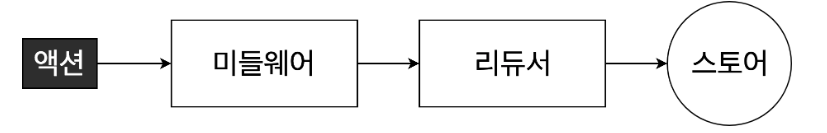

# 리덕스 미들웨어를 통한 비동기 작업 관리

## 18.1 작업 환경 준비
- yarn create react-app learn-redux-middleware

- counter 리덕스 모듈 작성
- 루트 리듀서 작성
- index.js에서 스토어 생성 후 Provider로 리액트 프로젝트에 리덕스 적용
- 카운터 컴포넌트와 카운터 컨테이너 컴포넌트 생성

## 18.2 미들웨어란?
- 리덕스 미들웨어는 액션을 디스패치했을 때 리듀에서 이를 처리하기에 앞서 사전에 지정된 작업들을 실행한다.
- 액션과 리듀서 사이의 중간자

### 18.2.1 미들웨어 만들기