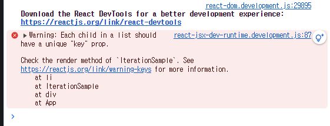

## 6장 컴포넌트 반복

### 6.1 자바스크립트 배열의 map() 함수
### 6.1.1 문법
```javascript
arr.map(callback,[thisArg])
```
- callback: 새로운 배열의 요소를 생성하는 함수
- currentValue: 현재 처리하고 있는 요소
- index : 현재 처리하고 있는 요소의 index 값
- array : 현재 처리하고 있는 원본 배열
- thisArg(선택항목): callback 함수 내부에서 사용할 this 레퍼런스

### 6.1.2 예제
```javascript
const numbers = [1,2,3,4,5];
const processed = numbers.map((num) =>{
    return num*num;
});
```

### 6.2.1 컴포넌트 수정하기
```javascript
import React from 'react';
import IterationSample from './iteration/iterationSample'

const App = () => {
  return (
    <div>
      <IterationSample/>  
    </div>
  );
};

export default App;
```

- 단 아직 'key' prop이 없다는 경고 메시지가 표시된다.

## 6.3 Key
### 6.3.1 Key 설정
```javascript
const IterationSample = () =>{
    const names = ['눈사람','얼음','눈','바람'];
    const nameList = names.map((name,index) => <li key={index}>{name}</li>);
    return(
        <div>
            <ul>
                {nameList}
            </ul>
        </div>
    )
}

export default IterationSample;
```
- 고유한 값이 없을 때만 index를 키로 활용해야 한다. 배열이 변경될 때 효율적으로 렌더링 하지 못 하기 때문이다.

## 6.4 응용

### 6.4.2 데이터 추가 기능 구현
```javascript
import { useState } from "react";

const IterationSample = () =>{
    const [names, setNames] = useState([
        {id :1,text:'눈사람'},
        {id:2,text:'얼음'},
        {id:3,text:'눈'},
        {id:4,text:'바람'}
    ]);
    const [inputText,setInputText] = useState('');
    const [nextId,setNextId] = useState(5); //새로운 항목을 추가할 때 사용할 id
    const onCHange= e => setInputText(e.target.value);
    const onClick = () => {
        const nextNames = names.concat({
        id : nextId,
        text : inputText
    });
    setNextId(nextId+1);
    setNames(nextNames);
    setInputText('');
    };

    const nameList = names.map((name) => <li key={name.id}>{name.text}</li>);
    return(
        <div>
            <input value={inputText} onChange={onCHange}/>
            <button onClick={onClick}>추가</button>
            <ul>{nameList}</ul>
        </div>
    )
}

export default IterationSample;
```

### 6.4.3 데이터 제거 기능 구현하기
```javascript
import { useState } from "react";

const IterationSample = () =>{
    const [names, setNames] = useState([
        {id :1,text:'눈사람'},
        {id:2,text:'얼음'},
        {id:3,text:'눈'},
        {id:4,text:'바람'}
    ]);
    const [inputText,setInputText] = useState('');
    const [nextId,setNextId] = useState(5); //새로운 항목을 추가할 때 사용할 id
    const onCHange= e => setInputText(e.target.value);
    const onClick = () => {
        const nextNames = names.concat({
        id : nextId,
        text : inputText
    });
    setNextId(nextId+1);
    setNames(nextNames);
    setInputText('');
    };
    const onRemove= (id) =>{
        const nextNames = names.filter(name => name.id !== id);
        setNames(nextNames);
    }


    const nameList = names.map((name) => <li key={name.id}
                                onDoubleClick={() => onRemove(name.id)}>{name.text}</li>);
    return(
        <div>
            <input value={inputText} onChange={onCHange}/>
            <button onClick={onClick}>추가</button>
            <ul>{nameList}</ul>
        </div>
    )
}

export default IterationSample;
```