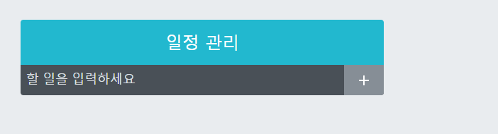
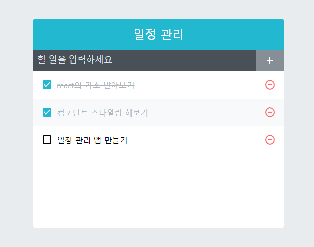

# 일정 관리 웹 애플리케이션 만들기
## 10.1 프로젝트 준비하기

### 10.1.1 프로젝트 생성 라이브러리 추가
1. sass
2. classnames
3. react-icons

### 10.1.2 Prettier 설정(옵션)

### 10.1.3 index.css 수정

### 10.1.4 App 컴포넌트 초기화

## 10.2 UI구성하기
1. TodoTamplate : 화연을 가운데 정렬, 앱 타이틀 부분
2. TodoInsert : 새로운 항목을 입력하고 추가할 컴포넌트

3. TodoListItem : 각 할 일 항목에 대한 정보를 보여주는 컴포넌트
4. TodoList : todos 배열을 props로 받아와 내잘 함수 map을 사용

## 10.3 기능 구현하기

### 10.3.1 App에서 todos 상태 사용하기

### 10.3.2 항목 추가 기능 구현하기

#### 10.3.2.2 리액트 개발자 도구
- 크롬 기준
- [React Developer Tools](https://chromewebstore.google.com/detail/react-developer-tools/fmkadmapgofadopljbjfkapdkoienihi?utm_source=ext_app_menu)