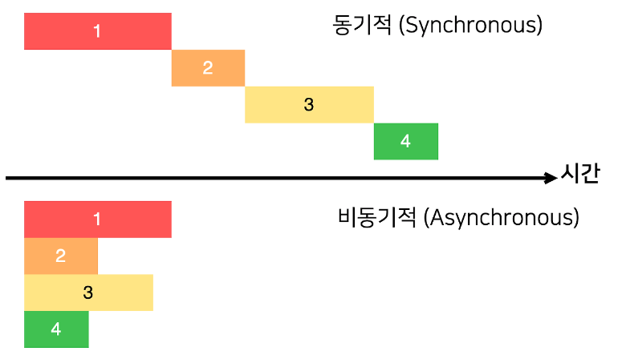
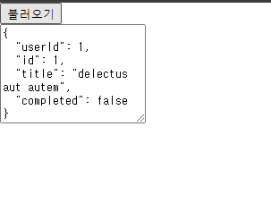
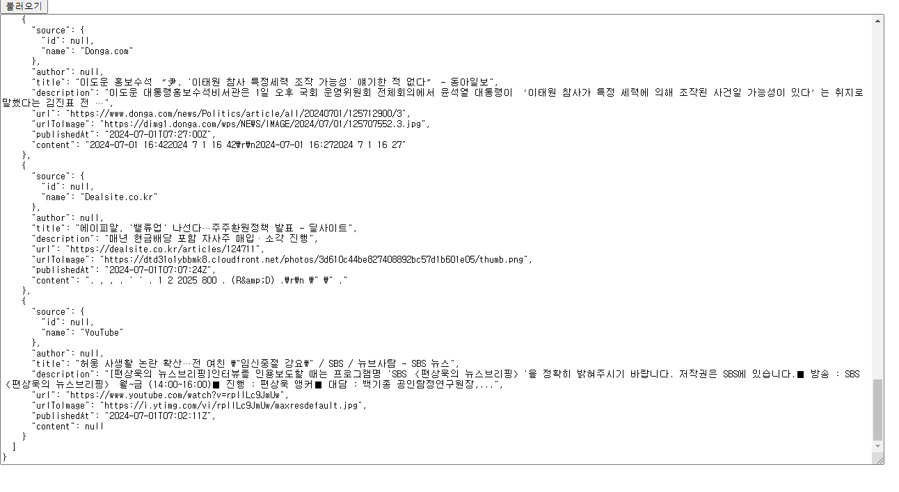

# 14장 외부 API를 연동하여 뉴스 뷰어 만들기
## 14.1 비동기 작업의 이해


### 14.1.1 콜백함수
- 콜백 지옥 <- 콜백 함수 안에 콜백을 넣어서 구현하는데 너무 여러 번 중첩되어 코드의 가독성이 떨어진 것.

### 14.1.2 Promise
- 콜백 지옥 카드 코드가 형성되지 않게 하는 방안으로 ES6에 도입된 가능

### 14.1.3 async/await
- Promise를 더욱 쉽게 사용할 수 있도록 해 주는 ES2017(ES8) 문법
함수 앞에 async 키워드를 추가하고 해당 함수 내부에서 Promise의 앞부분에 await 키워드를 사용

## 14.2 axios API 호출해서 데이터 받아 오기
```prompt
yarn create react-app news-viewer
```

```jsx
import { useState } from "react";
import axios from "../node_modules/axios/index";


function App() {
  const [data,setData] = useState(null);
  const onClick = () => {
    axios.get('https://jsonplaceholder.typicode.com/todos/1')
    .then(response => {
      setData(response.data);
    })
    .catch(error =>{
      console.log(error);
    });
  };

  return (
    <div>
      <div>
          <button onClick={onClick}>불러오기</button>
      </div>
        {data && <textarea rows={7} value={JSON.stringify(data,null,2)} readOnly={true}/>}
    </div>
  );
}

export default App;
```


## 14.3 newsapi APi 키 발급받기
[API 키 발급 받기](https://newsapi.org/register)

- 프로젝트 루트 디렉토리에 .env 파일을 생성하여 api 키를 숨기고 .gitignore에 .env파일 추가
- 프로젝트를 재시작해야 적용됨



## 14.4 뉴스 뷰어 UI 만들기
### 14.4.1 NewsItem 만들기
### 14.4.2 NewsList 만들기

## 14.5 데이터 연동하기


## 14.6 카테고리 기능 구현하기
- 카테고리
  1. business
  2. science
  3. entertainment
  4. sports
  5. health
  6. technology


### 14.6.1 카테고리 선택 UI 만들기

### 14.6.2 API를 호출할 때 카테고리 지정하기


## 14.7 리액트 라우터 적용하기

### 14.7.1 리액트 라우터의 설치 및 적용
```prompt
yarn add react-router-dom
```

### 14.7.2 NewsPage 생성

```jsx
import React from 'react';
import Categories from './components/Categories';
import NewsList from './components/NewsList';
import { useParams } from '../node_modules/react-router-dom/dist/index';
const NewsPage = () => {
    const params = useParams();
    const category = params.category || 'all'
    return (
        <>
          <Categories/>
          <NewsList category={category}/>  
        </>
    );
};

export default NewsPage;
```
```jsx
import { useCallback, useState } from "react";
import Categories from "./components/Categories";
import NewsList from "./components/NewsList";
import {Route,Routes} from 'react-router-dom'
import NewsPage from "./NewsPage";


function App() {

  return (
    <Routes>
      <Route path="/" element={<NewsPage/>}/>
      <Route path="/:category" element={<NewsPage/>}/>
    </Routes>
  );
}

export default App;
```

### 14.7.3 Categories에서 NavLink 사용하기
```jsx
import styled ,{css}from 'styled-components';
import { NavLink } from '../../node_modules/react-router-dom/dist/index';
const categories = [
    {
        name:'all',
        text:'전체보기'
    },
    {
        name:'business',
        text:'비즈니스'
    },
    {
        name:'entertainment',
        text:'엔터테인먼트'
    },
    {
        name:'science',
        text:'과학'
    },
    {
        name:'health',
        text:'건강'
    },
    {
        name:'sports',
        text:'스포츠'
    },
    {
        name:'technology',
        text:'기술'
    }
]

const CategoriesBlock = styled.div`
    display:flex;
    padding:1rem;
    width:768px;
    margin:0 auto;
    @media screen and (max-width: 768px){
        width : 100%;
        overflow-x : auto;
    }
`;

const Category = styled(NavLink)`
    font-size : 1.125rem;
    cursor : pointer;
    white-space:pre;
    text-decoration : none;
    color: inherit;
    padding-bottom:0.25rem;

    &:hover{
        color:#495057;
    }
    &.active{
        font-weight:600;
        border-bottom: 
        2px solid #22b8cf;
        color:#22b8cf;
        &:hover{
            color:#3bc9db;
        }
    }
    & + &{
        margin-left : 1rem;
    }
`;


const Categories = ({onSelect,category}) => {
    return (
        <CategoriesBlock>
            {categories.map(c => (
                <Category key={c.name}
                            className={({isActive}) => (isActive ? 'active' : undefined)}
                            to={c.name === 'all'? '/' : `/${c.name}`}
                           >{c.text}</Category>
            ))}
        </CategoriesBlock>
    );
};

export default Categories;
```

## 14.8 usePromise 커스텀 Hook 만들기