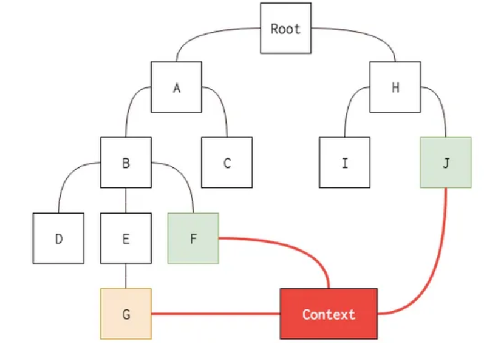

# Context API
- 리액트 프로젝트에서 전역적으로 사용할 데이터가 있을 때 유용한 기능
- ex. 사용자 로그인 정보, 애플리케이션 환경 설정, 테마 etc...
## 15.1 Context API를 사용한 전역 상태 관리 흐름 이해하기

## 15.2 Context API 사용법 익히기
```prompt
yarn create react-app context-tutorial
```
### 15.2.1 새 Context 만들기
```jsx
import {createContext} from 'react';

const ColorContext = createContext({color:'black'});

export default ColorContext;
```

### 15.2.2 Consumer 사용하기
```jsx
import ColorContext from "../contexts/color";

import React from 'react';

const ColorBox = () => {
    return (
        <ColorContext.Consumer>
            {value =>(
                <div
                style={{
                    width:'64px',
                    height:'64px',
                    background:value.color
                }}
                />
            )}
        </ColorContext.Consumer>
    );
};

export default ColorBox;
```
- Consumer 사이에 중괄호를 열어서 그 안에 함수를 넣어 주었는데, 이러한 패턴을 Function as a child 혹은 Render Props라고 한다.

### 15.2.3 Provider
- Provider를 사용하면 Context의 value를 변경할 수 있다.
```jsx
import './App.css';
import ColorBox from './components/ColorBox';
import ColorContext from './contexts/color';

function App() {
  return (
    <ColorContext.Provider value={{color : 'red'}}>
    <div>
      <ColorBox/>
    </div>
    </ColorContext.Provider>
  );
}

export default App;
```
- Provider를 사용했는데 value를 사용하지 않으면 오류가 발생한다.
- **Provider를 사용할 때는 value 값을 명시해 주어야 한다.**

## 15.3 동적 Context 사용하기
### 15.3.1 Context 파일 수정하기
- Context의 value에는 무조건 상태 값만 있어야하는 것은 아니다. **함수**를 전달해줄 수도 있다.
### 15.3.2 새로워진 Context를 프로젝트에 반영하기
- createContext의 기본값은 실제 Provider의 value에 넣는 객체의 형태와 일치시켜 주는 것이 좋다.
```jsx
import { createContext, useState } from 'react';

const ColorContext = createContext({
    state : {color :'black', subcolor:'red'},
    actions : {
        setColor: () =>{},
        setSubcolor : () => {}
    }
});

const ColorProvider = ({children}) => {
    const [color,setColor] = useState('black');
    const [subcolor,setSubcolor] = useState('red');

    const value = {
        state:{color,subcolor},
        actions:{setColor,setSubcolor}
    };
    return(
        <ColorContext.Provider value={value}>{children}</ColorContext.Provider>
    );
};

// const ColorConsumer = ColorContext.Consumer와 같은 의미
const {Consumer : ColorConsumer} = ColorContext;

// ColorProvider와 ColorConsumer 내보내기
export { ColorConsumer, ColorProvider };

export default ColorContext;
```

```jsx
import { ColorConsumer } from "../contexts/color";

import React from 'react';

const ColorBox = () => {
    return (
        <ColorConsumer>
            {value =>(
                <>
                <div
                style={{
                    width:'64px',
                    height:'64px',
                    background:value.state.color
                }}
                />
                <div
                style={{
                    width:'32px',
                    height:'32px',
                    background:value.state.subcolor
                }}
                />
                </>
            )}
        </ColorConsumer>
    );
};

export default ColorBox;
```
### 15.3.3 색상 선택 컴포넌트 만들기
- Context의 actions에 넣어 준 함수를 호출하는 컴포넌트를 만들기
- src/components/SelectColors.js 작성


## 15.4 Consumer 대신 Hook 또는 static contextType 사용하기

### 15.4.1 useContext Hook 사용하기
- useContext Hook을 사용해 훨씬 편하게 Context 값을 조회 할 수 있지만 Hook은 함수 컴포넌트에서만 사용할 수 있으므로 주의!
### 15.4.2 static contextType 사용하기
- 클래스형 컴포넌트에서 Context를 좀 더 쉽게 사용하려면 static contextType을 정의하는 방법이 있다.
## 15.5 정리
- Context API를 통해 컴포넌트 간에 상태를 더 쉽게 교류할 수 있다.