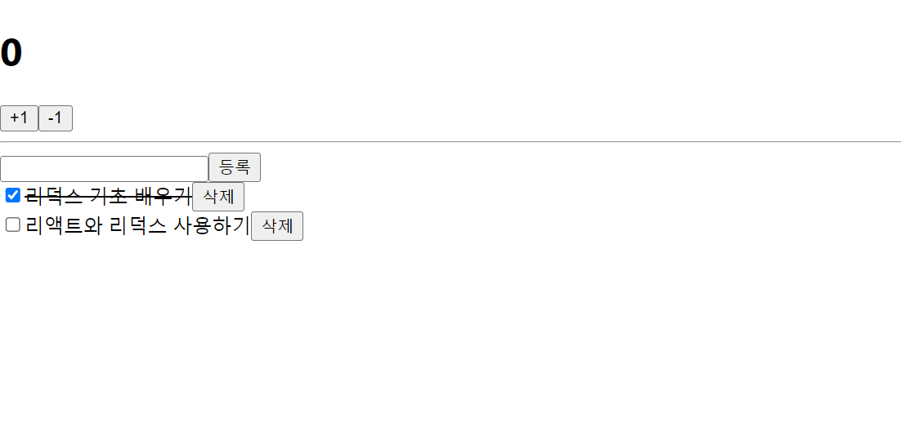
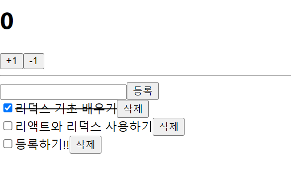

# 리덕스를 사용하여 리액트 애플리케이션 상태 관리하기
## 17.1 작업 환경 설정
```promt
yarn create react-app react-redux-tutorial
```
## 17.2 UI 준비하기
- 프레젠테이셔널 컴포넌트와 컨테이너 컴포넌트 분리
1. 프레젠테이셔널 컴포넌트 - props를 받아와서 화면에 UI를 보여 주기만 하는 컴포넌트
    - src/componets에 작성
2. 컨테이너 컴포넌트 - 리덕스와 연동되어 있는 컴포넌트
    - src/containers에 작성

### 17.2.1 카운터 컴포넌트 만들기
- src/components/Counter.js

### 17.2.2 할일 목록 컴포넌트 만들기
- src/components/Todos.js

## 17.3 리덕스 관련 코드 작성하기
- 기본 패턴
    - actions, constans, reducer라는 세 개의 디렉토리를 만들고 그 안에 기능별로 파일을 하나씩 만드는 방식
- Ducks 패턴
    - 액션 타입, 생성 함수, 리듀서 함수를 기능별로 파일 하나에 몰아서 다 작성하는 방식

### 17.3.1 counter 모듈 작성하기
- Ducks 패턴을 사용하여 액션 타입, 액션 생성 함수, 리듀서를 작성한 코드를 모듈이라고 한다.

#### 17.3.1.1 액션 타입 정의하기
- modules/counter.js
- 액션 타입은 대문자로 정의하고 문자열 내용은 '모듈 이름/액션 이름'과 같은 형태로 작성

#### 17.3.1.2 액션 생성 함수 만들기

#### 17.3.1.3 초기 상태 및 리듀서 함수 만들기

### 17.3.2 todos 모듈 만들기
- modules/todos.js

#### 17.3.2.1 액션 타입 정의하기

#### 17.3.2.2 액션 생성 함수 만들기

#### 17.3.2.3 초기 상태 및 리듀서 함수 만들기

### 17.3.3 루트 리듀서 만들기
- modules/index.js 작성

## 17.4 리액트 애플리케이션에 리덕스 적용하기

### 17.4.1 스토어 만들기
- src/index.js 수정

### 17.4.2 Provider 컴포넌트를 사용하여 프로젝트에 리덕스 적용하기

## 17.5 컨테이너 컴포넌트 만들기
### 17.5.1 CounterContainer 만들기
containers/Countercontainer.js 작성

### 17.5.2 TodosContainer 만들기
containers/TodosContainer.js 작성
- 무슨 값을 입력해도 todos/CHANGE_INPUT이 등록되고, 고정되는 현상이 발생
    - 확인해보니
    ```jsx
    case CHANGE_INPUT:
            return{
                ...state,
                input: CHANGE_INPUT
            }
    ```
    으로 설정 되어 있었음
    ```jsx
        case CHANGE_INPUT:
            return{
                ...state,
                input: action.input
            }
    ```
    으로 바꾸고 문제 해결!
    




## 17.6 리덕스 더 편하게 사용하기

### 17.6.1 redux-actions
- redux-actions를 사용하면 액션 생성 함수를 더 짧은 코드로 작성할 수 있다.
- 리듀서를 작성할 때에도 switch/case문이 아닌 handleActions라는 함수를 사용하여 각 액션마다 업데이트 함수를 설정하는 형식으로 작성해 줄 수 있다.
```prompt
yarn add redux-actions
```

#### 17.6.1.1 counter 모듈에 적용하기
```jsx
modules/counter
import {createAction} from 'redux-actions';

const INCREASE = 'counter/INCREASE';
const DECREASE = 'counter/DECREASE';
```

```jsx
modules/counter
import {createAction, handleActions} from 'redux-actions';

const INCREASE = 'counter/INCREASE';
const DECREASE = 'counter/DEACREASE';


export const increase = createAction(INCREASE);
export const decrease = createAction(DECREASE);

const initialState = {
    number :0
};
const counter = handleActions({
    [INCREASE]: (state,action) => ({number:state.number + 1}),
    [DECREASE]: (state,action) => ({number: state.number - 1}),
    },
    initialState,
);
export default counter;
```

#### 17.6.1.2 todos 모듈에 적용하기
```jsx
import { createAction, handleActions } from "redux-actions";

const CHANGE_INPUT = "todos/CHANGE_INPUT";
const INSERT = "todos/INSERT";
const TOGGLE = "todos/TOGGLE";
const REMOVE = "todos/REMOVE";

export const changeInput = createAction(CHANGE_INPUT, (input) => input);
let id = 3;
export const insert = createAction(INSERT, (text) => ({
  id: id++,
  text,
  done: false,
}));

export const toggle = createAction(TOGGLE, (id) => id);
export const remove = createAction(REMOVE, (id) => id);

const initialState = {
  input: "",
  todos: [
    {
      id: 1,
      text: "리덕스 기초 배우기",
      done: true,
    },
    {
      id: 2,
      text: "리액트와 리덕스 사용하기",
      done: false,
    },
  ],
};

const todos = handleActions(
  {
    [CHANGE_INPUT]: (state, {payload:input}) => ({ ...state, input: input }),
    [INSERT]: (state, {payload:todo}) => ({
      ...state,
      todos: state.todos.concat(todo),
    }),
    [TOGGLE]: (state, {payload:id}) => ({
      ...state,
      todos: state.todos.map((todo) =>
        todo.id === id ? { ...todo, done: !todo.done } : todo
      ),
    }),
    [REMOVE]: (state, {payload:id}) => ({
      ...state,
      todos: state.todos.filter((todo) => todo.id !== id),
    }),
  },
  initialState
);
```
### 17.6.2 immer

```jsx
yarn add immer
```

- immer를 사용해 todos 모듈 수정하기

## 17.7 Hooks를 사용하여 컨테이너 컴포넌트 만들기
### 17.7.1 useSelector로 상태 조회하기
- const 결과 = userSelector(상태 선택 함수);

containers/CounterContainer.js 수정

###  17.7.2 useDispatch를 사용하여 액션 디스패치하기
- const dispatch = userDispatch();
- dispatch({type:'SAMPLE_ACTION'});
- useDispatch를 사용할 때에는 useCallback과 함게 사용하는 습관을 들이자.

### 17.7.3 useStore를 사용하여 리덕스 스토어 사용하기
- const store = useStore();
- store.dispatch({type:'SAMPLE_ACTION'});
- store.getState();

### 17.7.4 TodosContainer를 Hooks로 전환하기
- cotainers/TodosContainer.js 수정

### 17.7.5 userActions 유틸 Hook을 만들어서 사용하기
- lib/useActions.js 생성하기
```jsx
import { bindActionCreators } from "redux";
import { useDispatch } from "react-redux";
import {useMemo } from "react";

export default function useActions(actions,deps){
    const dispatch = useDispatch();
    return useMemo(
        () =>{
            if(Array.isArray(actions)){
                return actions.map(a => bindActionCreators(a,dispatch));
            }
            return bindActionCreators(actions,dispatch);
        },
        deps ? [dispatch,...deps] : deps
    );
}
```
- containers/TodoContainer.js 수정하기


### 17.7.6 connect 함수와의 주요 차이점
- connect 함수를 사용하여 컨테이너 컴포넌트를 만들었을 경우, 부모 컴포넌트가 리렌더링 될 때 해당 컨테이너 컴포넌트의 props가 변하지 않았다면 리렌더링이 방지되어 성능이 최적화된다.
- useSelector를 사용하여 리덕스 상태를 조회했을 때는 이 작업이 자동으로 되지 않으므로, 성능 최적하를 위해선 React.memo를 컨테이너 컴포넌트 내부에 사용해 주어야 한다.
## 17.8 정리
